.. _groupxray_lab:

-----
X-Ray
-----

Overview
++++++++

.. note::

  Estimated time to complete: **60 Minutes**

X-Ray is an automated testing application for virtualized infrastructure solutions. It is capable of running test scenarios end-to-end to evaluate system attributes in real-world use cases. In this exercise you will deploy and configure an X-Ray VM, run X-Ray tests, and analyze results.

As X-Ray powers down hosts for tests that evaluate availability and data integrity, it is best practice to run the X-Ray VM outside of the target cluster. Additionally, the X-Ray VM itself creates a small amount of storage and CPU overhead that could potentially skew results.

For environments where DHCP is unavailable (or there isn't a sufficiently large pool of addresses available), X-Ray supports `Link-local <https://en.wikipedia.org/wiki/Link-local_address>`_ or "Zero Configuration" networking, where the VMs communicate via self-assigned IPv4 addresses. In order to work, all of the VMs (including the X-Ray VM) need to reside on the same Layer 2 network. To use Link-local networking, your X-Ray VM's first NIC (eth0) should be on a network capable of communicating with your cluster. A second NIC (eth1) is added on a network without DHCP.

Cluster Details
...............

Using the spreadsheet below, locate your **Group Number** and corresponding details for your group's assigned cluster.

.. raw:: html

  <iframe src=https://docs.google.com/spreadsheets/d/e/2PACX-1vQyI5rZlI4OQ5KbbUmEYXYRKb7zHvmFGQlqBmFqynNc4BNNlzBvgUamtfIdy2AlGLZYektSupV1_72a/pubhtml?gid=0&amp;single=false&amp;widget=false&amp;chrome=false&amp;headers=false&amp;range=a1:m41 style="position: relative; height: 500px; width: 100%; border: none"></iframe>

References and Downloads
........................

- `X-Ray Guide <https://portal.nutanix.com/#/page/docs/details?targetId=X-Ray-Guide-v31:X-Ray-Guide-v31>`_ - *X-Ray documentation*
- `X-Ray Downloads <https://portal.nutanix.com/#/page/static/supportTools>`_ - *Portal location to download the latest X-Ray OVA and QCOW2 images.*
- `X-Ray Vision as Nutanix Goes Open Source <https://www.nutanix.com/2018/05/09/x-ray-vision-as-nutanix-goes-open-source/>`_ - *Nutanix blog article explaining the impact of open sourcing X-Ray.*
- `Nutanix GitLab Page <https://gitlab.com/nutanix>`_ - *Public facing repository of opensource X-Ray components including scenarios and Curie engine.*
- `HCI Performance Testing Made Easy (Part 1) <https://www.n0derunner.com/2018/09/hci-performance-testing-made-easy-part-1/>`_ - *Gary Little blog/video series on using X-Ray.*
- `HCI Performance Testing Made Easy (Part 2) <https://www.n0derunner.com/2018/09/hci-performance-testing-made-easy-part-2/>`_ - *Gary Little blog/video series on using X-Ray.*
- `HCI Performance Testing Made Easy (Part 3) <https://www.n0derunner.com/2018/09/hci-performance-testing-made-easy-part-3/>`_ - *Gary Little blog/video series on using X-Ray.*

Configuring Target Cluster Networks
+++++++++++++++++++++++++++++++++++

Log into **Prism** on your 3-node **POC** cluster (10.21.\ *XYZ*\ .37).

Open **Prism > VM > Table** and click **Network Config**.

.. figure:: images/0.png

Before creating the VM, we must first create a virtual network to assign to the Foundation VM. The network will use the Native VLAN assigned to the physical uplinks for all 4 nodes in the block.

Click **Virtual Networks > Create Network**.

Fill out the following fields and click **Save**:

- **Name** - Primary
- **VLAD ID** - 0

Click **Create Network**. Using the `Cluster Details`_ spreadsheet, fill out the following fields and click **Save**:

- **Name** - Secondary
- **VLAD ID** - *<Secondary VLAN ID>*

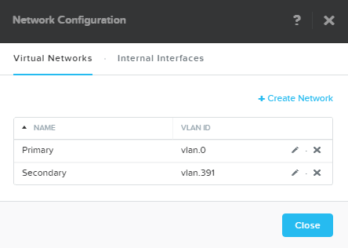

Creating X-Ray VM
+++++++++++++++++

Log into **Prism** on your **NHTLab** 1-node cluster (10.21.\ *XYZ*\ .32).

In **Prism > VM > Table** and click **+ Create VM**.

Fill out the following fields and click **Save**:

- **Name** - XRay
- **vCPU(s)** - 2
- **Number of Cores per vCPU** - 1
- **Memory** - 4 GiB
- Select **+ Add New Disk**

  - **Operation** - Clone from Image Service
  - **Image** - X-Ray
  - Select **Add**
- Select **Add New NIC**

  - **VLAN Name** - Primary
  - Select **Add**
- Select **+ Add New NIC**

  - **VLAN Name** - Secondary
  - Select **Add**

Select your **XRay** VM and click **Power on**.

.. note::

  At the time of writing, X-Ray 3.1 is the latest available version. The URL for the latest X-Ray OVA & QCOW2 images can be downloaded from the `Nutanix Portal <https://portal.nutanix.com/#/page/static/supportTools>`_.

Once the VM has started, click **Launch Console**.

Click the **Network** icon in the upper right-hand corner of the XRay VM console and select **Ethernet (eth0) Connected > Wired Settings**.

.. note::

  It is critical that you select the network adapter assigned to the **Primary** network (you can confirm by comparing the MAC address in the VM console to the MAC address shown in Prism). We will use this network to assign a static IP to the X-Ray VM to access the web interface. We will NOT assign an address to the **Secondary** network adapter. This network will be used for zero configuration communication between the X-Ray VM and client VMs. This approach is helpful when DHCP isn't available or the DHCP scope isn't large enough to support X-Ray testing.

.. figure:: images/2.png

Select **Ethernet (eth0)** and click the **Gear Icon**.

.. figure:: images/3.png

Select **IPv4**. Using the `Cluster Details`_ spreadsheet, fill out the following fields and click **Apply**:

- **Addresses** - Manual
- **Address** - 10.21.\ *XYZ*\ .42
- **Netmask** - 255.255.255.128
- **Gateway** - 10.21.\ *XYZ*\ .1
- **DNS** - 10.21.253.10

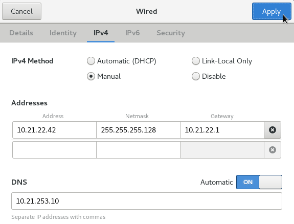

Use the toggle switch to turn the **eth0** adapter off and back on to ensure the new IP is applied.

.. raw:: html

  <strong>Close the XRay VM console. You will use the browser in your Citrix XenDesktop session for the remainder of the lab.</strong>

Configuring X-Ray
+++++++++++++++++

Open \https://<*XRAY-VM-IP*>/ in a browser. Enter a password for the local secret score, such as your Prism cluster password, and click **Enter**.

.. figure:: images/7.png

Select **I have read and agree to the terms and conditions** and click **Accept**.

.. figure:: images/8.png

Select **I have read and agree to the terms and conditions** and click **Accept**.

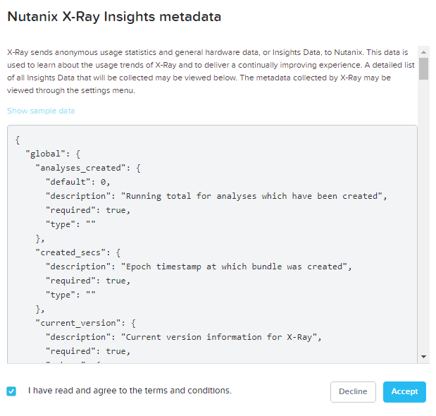

Click **Log in** and specify your my.nutanix.com credentials. Fill out the following fields and click **Generate Token**:

- **Customer Name** - Nutanix Sales Enablement
- **Opportunity ID** - New Hire Training
- **Choose a reason for using X-Ray** - Self training on Nutanix

.. figure:: images/5.png

Click **Done**.

.. figure:: images/6.png

.. note::

  If deploying X-Ray in an environment without internet access, tokens can be generated at https://my.nutanix.com/#/page/xray.

Select **Targets** from the navigation bar and click **+ New Target**. Fill out the following fields and click **Next**:

- **Name** - POC-Cluster
- **Manager Type** - Prism
- **Power Management Type** - IPMI
- **Username** - ADMIN
- **Password** - ADMIN
- **Prism Address** - *<3-Node Cluster Virtual IP>*
- **Username** - admin
- **Password** - techX2018!

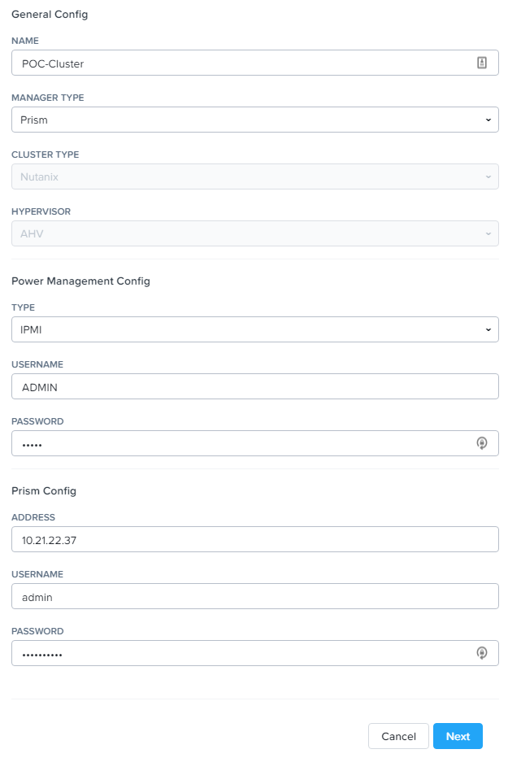

Select **Secondary** under **Network** and click **Next**.

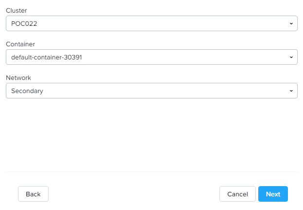

Select **Supermicro** from the **IPMI Type** menu. Review **Node Info** and click **Next**.

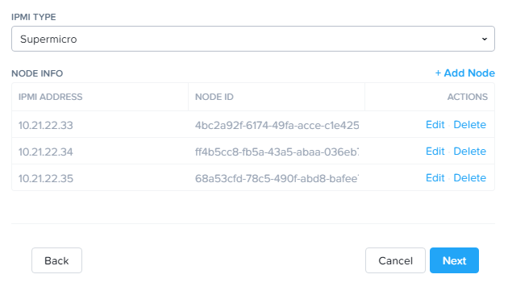

Click **Run Validation**.

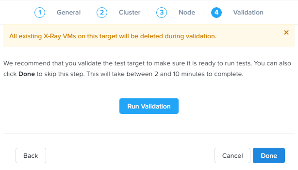

Click **Check Details** to view validation progress.

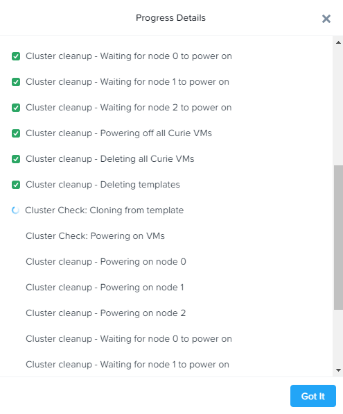

Upon successful completion of validation, click **Done**.

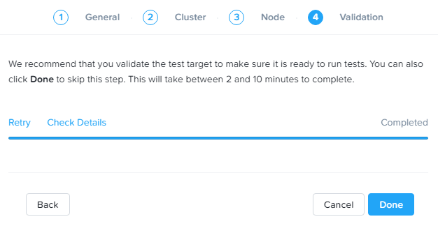

Running X-Ray Tests
+++++++++++++++++++

While X-Ray offers many testing options that evaluate critical Day 2+ scenarios, for lack of time, we will utilize a simple microbenchmark test in this exercise.

Select **Tests** from the navigation bar and select **Four Corners Microbenchmark**.

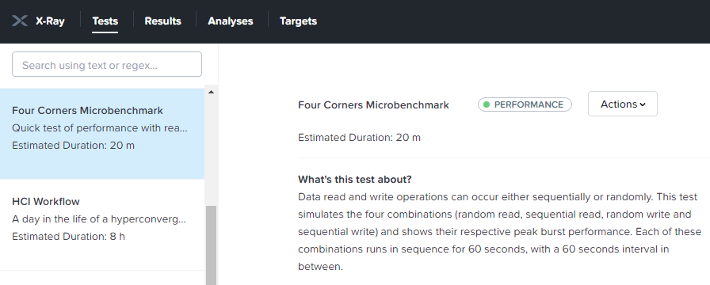

Review the test description, then select your **POC-Cluster** under **Targets** and click **Add to Queue**.

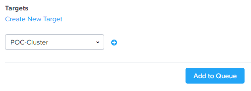

.. note::

  X-Ray can run one test per target at a time. Many tests can be queued for a single target, allowing X-Ray to automatically run through multiple tests without requiring manual intervention. Through automation, X-Ray can drastically decrease the amount of time to conduct a POC.

Select **Results** from the navigation bar and select the **Four Corners Microbenchmark** under **In Progress Tests**.

.. figure:: images/19.png

Click **In progress** for additional details on the running test.

When the test reaches the **Run** phase, log into Prism on your 3-node cluster to monitor VM performance during the test.

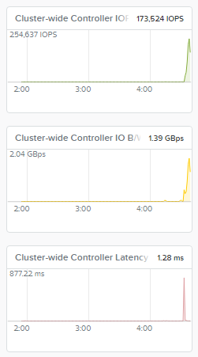

.. note::

  High storage latency is expected during the "pre-filling" stage prior to running the target workloads as X-Ray worker VMs are writing sequential 1MB blocks to their disks to ensure the tests do not read only zeroes.

Upon completion of the test, select the **POC-Cluster Four Corners Microbenchmark** now located under **Completed Tests**.

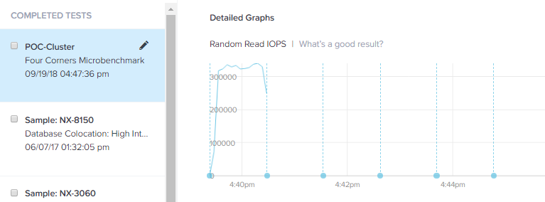

The graphs are interactive, and you can click and drag to zoom into specific data/times on each individual graph. You can zoom out by clicking **Reset Zoom**.

Each dotted blue line represents an event in the test, such as beginning a workload, powering off a node, etc. Clicking the blue dots will provide information about the event.

Clicking the **Actions** drop down menu provides options to view the detailed log data, export the test results, and generate a PDF report.

Working with X-Ray Results
++++++++++++++++++++++++++

As X-Ray is using automation to perform the exact same tests and collect the same metrics on multiple systems/hypervisors, the results can be easily overlaid to compare solutions. In this exercise you will use X-Ray to compare BigData Ingestion test results between Nutanix and a competitor.

The BigData Ingestion test compares the speed at which 1TB of sequential data can be written to a single VM on a cluster, as is common in workloads such as Splunk.

Download the following exported X-Ray test results:

- :download:`Competitor Big Data Ingest Results<xray-big-data-competitor.zip>`
- :download:`Nutanix Big Data Ingest Results<xray-big-data-nutanix.zip>`

Select :fa:`cog` **> Import Test Results** from the navigation bar.

Click **Choose File** and select the Nutanix test results .zip file previously downloaded. Click **Import**.

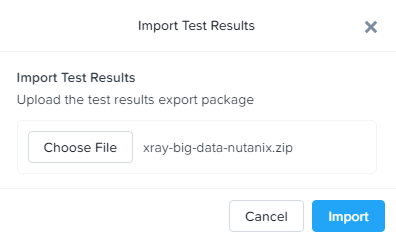

Repeat to import the Competitor test results .zip file.

Select **Analyses** from the navigation bar and click **Create Analysis**.

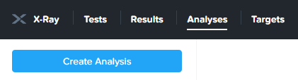

Select the 2 **BigData Ingestion** results and click **Create**.

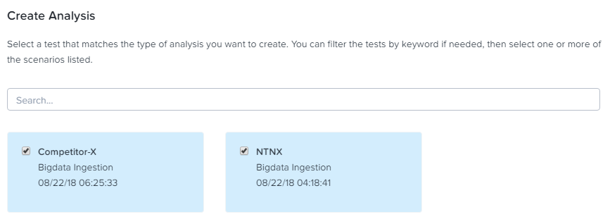

The resulting charts show the combined metrics for both solutions. In this case we can clearly see that the Nutanix solution is able to sustain a higher, and more consistent, rate of write throughput, resulting in a much faster time to complete ingesting the 1TB of data.

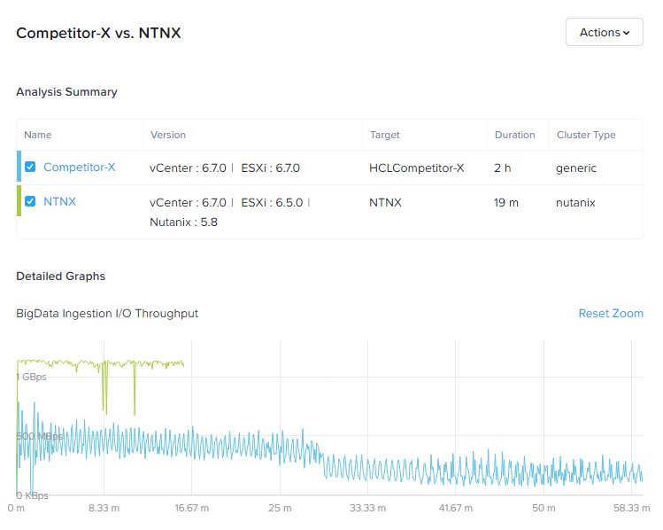

.. note::

  Can you explain **why** the Nutanix solution may produce better results than common HCI competitors?

  Hint! Check out the `OpLog <http://nutanixbible.com/\#anchor-i/o-path-and-cache-67>`_ section of the Nutanix Bible.

To export analysis results for use in proposal documents, etc., click **Actions > Create report**. Multiple analyses can also be selected to generate a combined report with the results from multiple tests, this can be extremely useful for summarizing POC results.
